# Election Data Analysis
## Mihir Garg

### 1. Poll Data Analysis


```python
# Importing Libraries
import numpy as np
import pandas as pd
from pandas import Series,DataFrame

# For Visualization
import matplotlib as plt
import seaborn as sns
sns.set_style('whitegrid')
sns.set(font_scale=2)
% matplotlib inline

# Resize the size of plots
fig_size = plt.rcParams["figure.figsize"]
 
# Set figure width to 12 and height to 9
fig_size[0] = 14
fig_size[1] = 10
plt.rcParams["figure.figsize"] = fig_size
```


```python
# Import Dataset
poll = pd.read_csv('2016-general-election-trump-vs-clinton.csv')
poll.head()
```


<div>
<style>
    .dataframe thead tr:only-child th {
        text-align: right;
    }

    .dataframe thead th {
        text-align: left;
    }

    .dataframe tbody tr th {
        vertical-align: top;
    }
</style>
<table border="1" class="dataframe">
  <thead>
    <tr style="text-align: right;">
      <th></th>
      <th>Pollster</th>
      <th>Start Date</th>
      <th>End Date</th>
      <th>Entry Date/Time (ET)</th>
      <th>Number of Observations</th>
      <th>Population</th>
      <th>Mode</th>
      <th>Trump</th>
      <th>Clinton</th>
      <th>Other</th>
      <th>Undecided</th>
      <th>Pollster URL</th>
      <th>Source URL</th>
      <th>Partisan</th>
      <th>Affiliation</th>
      <th>Question Text</th>
      <th>Question Iteration</th>
    </tr>
  </thead>
  <tbody>
    <tr>
      <th>0</th>
      <td>Insights West</td>
      <td>2016-11-04</td>
      <td>2016-11-07</td>
      <td>2016-11-08T12:16:30Z</td>
      <td>940.0</td>
      <td>Likely Voters</td>
      <td>Internet</td>
      <td>41.0</td>
      <td>45.0</td>
      <td>2.0</td>
      <td>8.0</td>
      <td>http://elections.huffingtonpost.com/pollster/p...</td>
      <td>http://www.insightswest.com/news/clinton-is-ah...</td>
      <td>Nonpartisan</td>
      <td>None</td>
      <td>As you may know, there will be a presidential ...</td>
      <td>1</td>
    </tr>
    <tr>
      <th>1</th>
      <td>Insights West</td>
      <td>2016-11-04</td>
      <td>2016-11-07</td>
      <td>2016-11-08T12:16:30Z</td>
      <td>NaN</td>
      <td>Likely Voters - Democrat</td>
      <td>Internet</td>
      <td>6.0</td>
      <td>89.0</td>
      <td>0.0</td>
      <td>4.0</td>
      <td>http://elections.huffingtonpost.com/pollster/p...</td>
      <td>http://www.insightswest.com/news/clinton-is-ah...</td>
      <td>Nonpartisan</td>
      <td>None</td>
      <td>As you may know, there will be a presidential ...</td>
      <td>1</td>
    </tr>
    <tr>
      <th>2</th>
      <td>Insights West</td>
      <td>2016-11-04</td>
      <td>2016-11-07</td>
      <td>2016-11-08T12:16:30Z</td>
      <td>NaN</td>
      <td>Likely Voters - Republican</td>
      <td>Internet</td>
      <td>82.0</td>
      <td>7.0</td>
      <td>2.0</td>
      <td>6.0</td>
      <td>http://elections.huffingtonpost.com/pollster/p...</td>
      <td>http://www.insightswest.com/news/clinton-is-ah...</td>
      <td>Nonpartisan</td>
      <td>None</td>
      <td>As you may know, there will be a presidential ...</td>
      <td>1</td>
    </tr>
    <tr>
      <th>3</th>
      <td>Insights West</td>
      <td>2016-11-04</td>
      <td>2016-11-07</td>
      <td>2016-11-08T12:16:30Z</td>
      <td>NaN</td>
      <td>Likely Voters - independent</td>
      <td>Internet</td>
      <td>38.0</td>
      <td>43.0</td>
      <td>4.0</td>
      <td>7.0</td>
      <td>http://elections.huffingtonpost.com/pollster/p...</td>
      <td>http://www.insightswest.com/news/clinton-is-ah...</td>
      <td>Nonpartisan</td>
      <td>None</td>
      <td>As you may know, there will be a presidential ...</td>
      <td>1</td>
    </tr>
    <tr>
      <th>4</th>
      <td>IBD/TIPP</td>
      <td>2016-11-04</td>
      <td>2016-11-07</td>
      <td>2016-11-08T12:10:06Z</td>
      <td>1107.0</td>
      <td>Likely Voters</td>
      <td>Live Phone</td>
      <td>43.0</td>
      <td>41.0</td>
      <td>4.0</td>
      <td>5.0</td>
      <td>http://elections.huffingtonpost.com/pollster/p...</td>
      <td>http://www.investors.com/politics/ibd-tipp-pre...</td>
      <td>Nonpartisan</td>
      <td>None</td>
      <td>NaN</td>
      <td>1</td>
    </tr>
  </tbody>
</table>
</div>


```python
# Drop various colums from data as we dont need them
poll = poll.drop(['Pollster URL','Source URL','Partisan','Question Text','Question Iteration'],axis=1)
poll.head()
```


<div>
<style>
    .dataframe thead tr:only-child th {
        text-align: right;
    }

    .dataframe thead th {
        text-align: left;
    }

    .dataframe tbody tr th {
        vertical-align: top;
    }
</style>
<table border="1" class="dataframe">
  <thead>
    <tr style="text-align: right;">
      <th></th>
      <th>Pollster</th>
      <th>Start Date</th>
      <th>End Date</th>
      <th>Entry Date/Time (ET)</th>
      <th>Number of Observations</th>
      <th>Population</th>
      <th>Mode</th>
      <th>Trump</th>
      <th>Clinton</th>
      <th>Other</th>
      <th>Undecided</th>
      <th>Affiliation</th>
    </tr>
  </thead>
  <tbody>
    <tr>
      <th>0</th>
      <td>Insights West</td>
      <td>2016-11-04</td>
      <td>2016-11-07</td>
      <td>2016-11-08T12:16:30Z</td>
      <td>940.0</td>
      <td>Likely Voters</td>
      <td>Internet</td>
      <td>41.0</td>
      <td>45.0</td>
      <td>2.0</td>
      <td>8.0</td>
      <td>None</td>
    </tr>
    <tr>
      <th>1</th>
      <td>Insights West</td>
      <td>2016-11-04</td>
      <td>2016-11-07</td>
      <td>2016-11-08T12:16:30Z</td>
      <td>NaN</td>
      <td>Likely Voters - Democrat</td>
      <td>Internet</td>
      <td>6.0</td>
      <td>89.0</td>
      <td>0.0</td>
      <td>4.0</td>
      <td>None</td>
    </tr>
    <tr>
      <th>2</th>
      <td>Insights West</td>
      <td>2016-11-04</td>
      <td>2016-11-07</td>
      <td>2016-11-08T12:16:30Z</td>
      <td>NaN</td>
      <td>Likely Voters - Republican</td>
      <td>Internet</td>
      <td>82.0</td>
      <td>7.0</td>
      <td>2.0</td>
      <td>6.0</td>
      <td>None</td>
    </tr>
    <tr>
      <th>3</th>
      <td>Insights West</td>
      <td>2016-11-04</td>
      <td>2016-11-07</td>
      <td>2016-11-08T12:16:30Z</td>
      <td>NaN</td>
      <td>Likely Voters - independent</td>
      <td>Internet</td>
      <td>38.0</td>
      <td>43.0</td>
      <td>4.0</td>
      <td>7.0</td>
      <td>None</td>
    </tr>
    <tr>
      <th>4</th>
      <td>IBD/TIPP</td>
      <td>2016-11-04</td>
      <td>2016-11-07</td>
      <td>2016-11-08T12:10:06Z</td>
      <td>1107.0</td>
      <td>Likely Voters</td>
      <td>Live Phone</td>
      <td>43.0</td>
      <td>41.0</td>
      <td>4.0</td>
      <td>5.0</td>
      <td>None</td>
    </tr>
  </tbody>
</table>
</div>


```python
# Glimpse of data
poll.info()
```

    <class 'pandas.core.frame.DataFrame'>
    RangeIndex: 1522 entries, 0 to 1521
    Data columns (total 12 columns):
    Pollster                  1522 non-null object
    Start Date                1522 non-null object
    End Date                  1522 non-null object
    Entry Date/Time (ET)      1522 non-null object
    Number of Observations    1013 non-null float64
    Population                1522 non-null object
    Mode                      1522 non-null object
    Trump                     1522 non-null float64
    Clinton                   1522 non-null float64
    Other                     1098 non-null float64
    Undecided                 1460 non-null float64
    Affiliation               1522 non-null object
    dtypes: float64(5), object(7)
    memory usage: 142.8+ KB
    


```python
# Quick visualization overview of the affiliation for the polls
sns.factorplot('Affiliation',data=poll,kind='count',legend=True,color='orange',size=6)
```


    <seaborn.axisgrid.FacetGrid at 0xba534834e0>


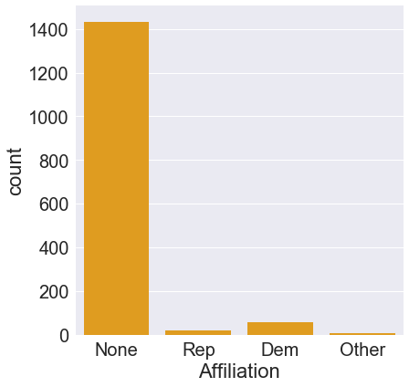


```python
sns.factorplot('Affiliation',data=poll,kind='count',legend=True,hue='Population',size=6,aspect=2,palette='dark')
```


    <seaborn.axisgrid.FacetGrid at 0xba5355c860>


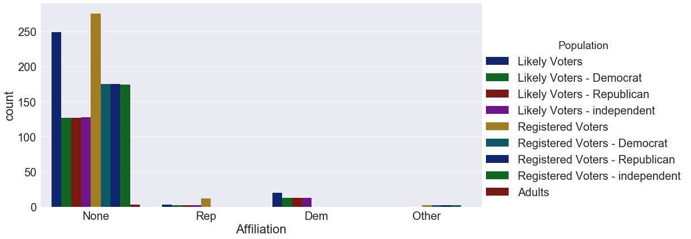


```python
# Averages of different candidates

average=pd.DataFrame(poll.mean())
average.drop('Number of Observations',inplace=True)
average
```


<div>
<style>
    .dataframe thead tr:only-child th {
        text-align: right;
    }

    .dataframe thead th {
        text-align: left;
    }

    .dataframe tbody tr th {
        vertical-align: top;
    }
</style>
<table border="1" class="dataframe">
  <thead>
    <tr style="text-align: right;">
      <th></th>
      <th>0</th>
    </tr>
  </thead>
  <tbody>
    <tr>
      <th>Trump</th>
      <td>40.643890</td>
    </tr>
    <tr>
      <th>Clinton</th>
      <td>42.733903</td>
    </tr>
    <tr>
      <th>Other</th>
      <td>5.806011</td>
    </tr>
    <tr>
      <th>Undecided</th>
      <td>9.315068</td>
    </tr>
  </tbody>
</table>
</div>


```python
# Standard Deviation to get the error

std=pd.DataFrame(poll.std())
std.drop('Number of Observations',inplace=True)
std
```


<div>
<style>
    .dataframe thead tr:only-child th {
        text-align: right;
    }

    .dataframe thead th {
        text-align: left;
    }

    .dataframe tbody tr th {
        vertical-align: top;
    }
</style>
<table border="1" class="dataframe">
  <thead>
    <tr style="text-align: right;">
      <th></th>
      <th>0</th>
    </tr>
  </thead>
  <tbody>
    <tr>
      <th>Trump</th>
      <td>23.566390</td>
    </tr>
    <tr>
      <th>Clinton</th>
      <td>25.298731</td>
    </tr>
    <tr>
      <th>Other</th>
      <td>5.009533</td>
    </tr>
    <tr>
      <th>Undecided</th>
      <td>6.253118</td>
    </tr>
  </tbody>
</table>
</div>


```python
average.plot(yerr=std,kind='bar',legend=False,color='seagreen',fontsize=20)
```


    <matplotlib.axes._subplots.AxesSubplot at 0xba53a5f278>


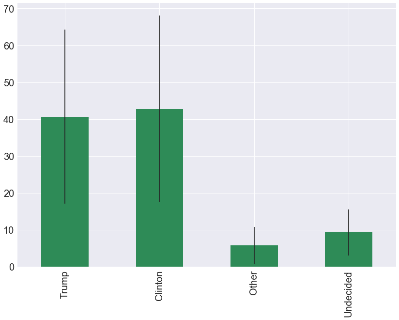


```python
# Consider undecided factor

poll_avg=pd.concat([average,std],axis=1)
poll_avg.column=['Average','STD']
poll_avg
```


<div>
<style>
    .dataframe thead tr:only-child th {
        text-align: right;
    }

    .dataframe thead th {
        text-align: left;
    }

    .dataframe tbody tr th {
        vertical-align: top;
    }
</style>
<table border="1" class="dataframe">
  <thead>
    <tr style="text-align: right;">
      <th></th>
      <th>0</th>
      <th>0</th>
    </tr>
  </thead>
  <tbody>
    <tr>
      <th>Trump</th>
      <td>40.643890</td>
      <td>23.566390</td>
    </tr>
    <tr>
      <th>Clinton</th>
      <td>42.733903</td>
      <td>25.298731</td>
    </tr>
    <tr>
      <th>Other</th>
      <td>5.806011</td>
      <td>5.009533</td>
    </tr>
    <tr>
      <th>Undecided</th>
      <td>9.315068</td>
      <td>6.253118</td>
    </tr>
  </tbody>
</table>
</div>


#### The polls indicate a fairly close race, but what about the undecided voters? 
#### Most of them will likely vote for one of the candidates once the election occurs. 
#### Split the undecided evenly between the two candidates.


```python
# Time series plot of favour of voters against time
poll.plot(x='End Date',y=['Trump','Clinton','Other','Undecided'],linestyle='',marker='s').legend(bbox_to_anchor=(1.5, 1))
```


    <matplotlib.legend.Legend at 0xba53aafd30>


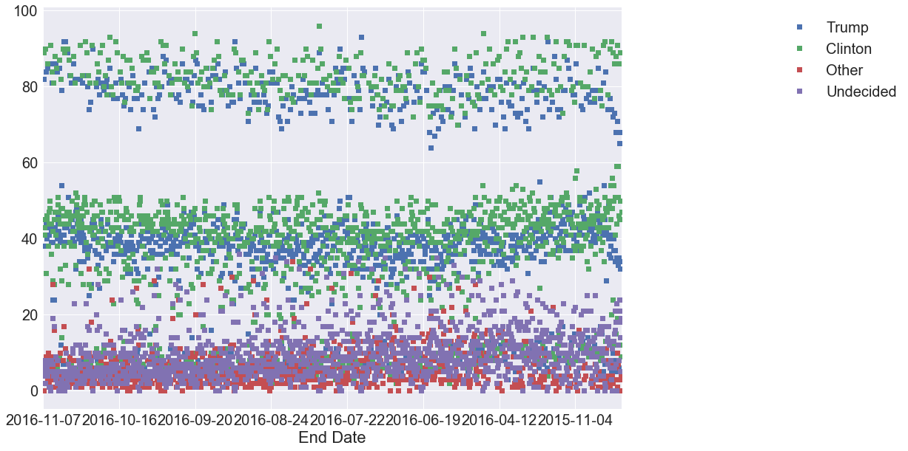


```python
# Plot out the difference between Tump and Clinton and how it changes as time moves along
from datetime import datetime

poll['Difference']=(poll.Trump-poll.Clinton)/100
poll.head()
```


<div>
<style>
    .dataframe thead tr:only-child th {
        text-align: right;
    }

    .dataframe thead th {
        text-align: left;
    }

    .dataframe tbody tr th {
        vertical-align: top;
    }
</style>
<table border="1" class="dataframe">
  <thead>
    <tr style="text-align: right;">
      <th></th>
      <th>Pollster</th>
      <th>Start Date</th>
      <th>End Date</th>
      <th>Entry Date/Time (ET)</th>
      <th>Number of Observations</th>
      <th>Population</th>
      <th>Mode</th>
      <th>Trump</th>
      <th>Clinton</th>
      <th>Other</th>
      <th>Undecided</th>
      <th>Affiliation</th>
      <th>Difference</th>
    </tr>
  </thead>
  <tbody>
    <tr>
      <th>0</th>
      <td>Insights West</td>
      <td>2016-11-04</td>
      <td>2016-11-07</td>
      <td>2016-11-08T12:16:30Z</td>
      <td>940.0</td>
      <td>Likely Voters</td>
      <td>Internet</td>
      <td>41.0</td>
      <td>45.0</td>
      <td>2.0</td>
      <td>8.0</td>
      <td>None</td>
      <td>-0.04</td>
    </tr>
    <tr>
      <th>1</th>
      <td>Insights West</td>
      <td>2016-11-04</td>
      <td>2016-11-07</td>
      <td>2016-11-08T12:16:30Z</td>
      <td>NaN</td>
      <td>Likely Voters - Democrat</td>
      <td>Internet</td>
      <td>6.0</td>
      <td>89.0</td>
      <td>0.0</td>
      <td>4.0</td>
      <td>None</td>
      <td>-0.83</td>
    </tr>
    <tr>
      <th>2</th>
      <td>Insights West</td>
      <td>2016-11-04</td>
      <td>2016-11-07</td>
      <td>2016-11-08T12:16:30Z</td>
      <td>NaN</td>
      <td>Likely Voters - Republican</td>
      <td>Internet</td>
      <td>82.0</td>
      <td>7.0</td>
      <td>2.0</td>
      <td>6.0</td>
      <td>None</td>
      <td>0.75</td>
    </tr>
    <tr>
      <th>3</th>
      <td>Insights West</td>
      <td>2016-11-04</td>
      <td>2016-11-07</td>
      <td>2016-11-08T12:16:30Z</td>
      <td>NaN</td>
      <td>Likely Voters - independent</td>
      <td>Internet</td>
      <td>38.0</td>
      <td>43.0</td>
      <td>4.0</td>
      <td>7.0</td>
      <td>None</td>
      <td>-0.05</td>
    </tr>
    <tr>
      <th>4</th>
      <td>IBD/TIPP</td>
      <td>2016-11-04</td>
      <td>2016-11-07</td>
      <td>2016-11-08T12:10:06Z</td>
      <td>1107.0</td>
      <td>Likely Voters</td>
      <td>Live Phone</td>
      <td>43.0</td>
      <td>41.0</td>
      <td>4.0</td>
      <td>5.0</td>
      <td>None</td>
      <td>0.02</td>
    </tr>
  </tbody>
</table>
</div>


```python
# Visualize how this sentiment in difference changes over time

poll=poll.groupby('Start Date',as_index=False).mean()
poll.head()
```


<div>
<style>
    .dataframe thead tr:only-child th {
        text-align: right;
    }

    .dataframe thead th {
        text-align: left;
    }

    .dataframe tbody tr th {
        vertical-align: top;
    }
</style>
<table border="1" class="dataframe">
  <thead>
    <tr style="text-align: right;">
      <th></th>
      <th>Start Date</th>
      <th>Number of Observations</th>
      <th>Trump</th>
      <th>Clinton</th>
      <th>Other</th>
      <th>Undecided</th>
      <th>Difference</th>
    </tr>
  </thead>
  <tbody>
    <tr>
      <th>0</th>
      <td>2015-05-19</td>
      <td>1046.00</td>
      <td>34.25</td>
      <td>48.75</td>
      <td>2.5</td>
      <td>14.00</td>
      <td>-0.1450</td>
    </tr>
    <tr>
      <th>1</th>
      <td>2015-06-20</td>
      <td>420.75</td>
      <td>35.00</td>
      <td>47.25</td>
      <td>NaN</td>
      <td>17.75</td>
      <td>-0.1225</td>
    </tr>
    <tr>
      <th>2</th>
      <td>2015-06-21</td>
      <td>1005.00</td>
      <td>34.00</td>
      <td>51.00</td>
      <td>3.0</td>
      <td>12.00</td>
      <td>-0.1700</td>
    </tr>
    <tr>
      <th>3</th>
      <td>2015-06-26</td>
      <td>890.00</td>
      <td>36.75</td>
      <td>57.00</td>
      <td>6.0</td>
      <td>0.00</td>
      <td>-0.2025</td>
    </tr>
    <tr>
      <th>4</th>
      <td>2015-07-09</td>
      <td>499.25</td>
      <td>35.25</td>
      <td>49.50</td>
      <td>NaN</td>
      <td>16.00</td>
      <td>-0.1425</td>
    </tr>
  </tbody>
</table>
</div>


```python
# Plotting the difference in polls between Trump and Clinton
poll.plot('Start Date','Difference',figsize=(25,15),marker='s',color='red')
```


    <matplotlib.axes._subplots.AxesSubplot at 0xba55058e10>


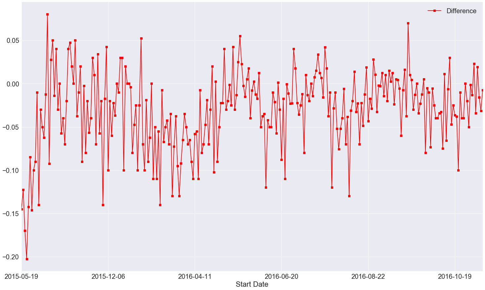


```python
# Plot marker lines on the dates of the debates and see if there is any general insight to the poll results
# The debate dates were Sept 26th, Oct 9th and Oct 19th 0f 2016

row_in=0
xlimit=[]

for date in poll['Start Date']:
    if date[0:7] == '2016-09':
        xlimit.append(row_in)
        row_in +=1
    else:
        row_in +=1
        
print (min(xlimit))

row_in=0
xlimit=[]

for date in poll['Start Date']:
    if date[0:7] == '2016-10':
        xlimit.append(row_in)
        row_in +=1
    else:
        row_in +=1
        
print (max(xlimit))
```

    209
    262
    


```python
poll.plot('Start Date','Difference',figsize=(25,15),marker='s',color='red',xlim=(209,262))
plt.pyplot.axvline(x=209+27, linewidth=4, color='grey')
plt.pyplot.axvline(x=209+40, linewidth=4, color='grey')
plt.pyplot.axvline(x=209+50, linewidth=4, color='grey')
```


    <matplotlib.lines.Line2D at 0xba53aafa90>


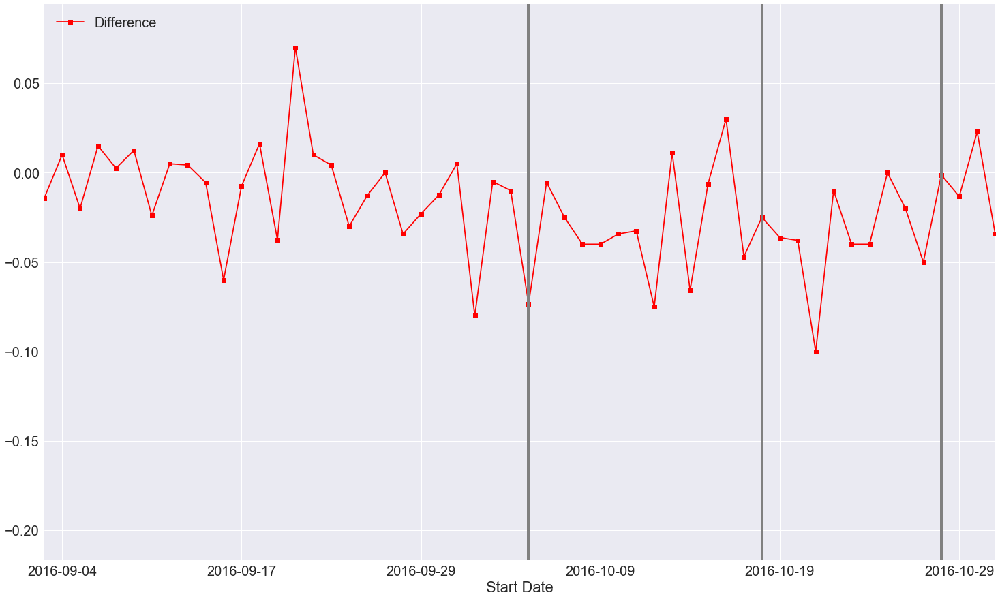


### 2. Donor Data Analysis


```python
# Import Donor data
donor=pd.read_csv('Donor_Data.csv')
donor.head()
```

    C:\Users\mihir_garg\Anaconda3\lib\site-packages\IPython\core\interactiveshell.py:2717: DtypeWarning: Columns (6) have mixed types. Specify dtype option on import or set low_memory=False.
      interactivity=interactivity, compiler=compiler, result=result)
    


<div>
<style>
    .dataframe thead tr:only-child th {
        text-align: right;
    }

    .dataframe thead th {
        text-align: left;
    }

    .dataframe tbody tr th {
        vertical-align: top;
    }
</style>
<table border="1" class="dataframe">
  <thead>
    <tr style="text-align: right;">
      <th></th>
      <th>cmte_id</th>
      <th>cand_id</th>
      <th>cand_nm</th>
      <th>contbr_nm</th>
      <th>contbr_city</th>
      <th>contbr_st</th>
      <th>contbr_zip</th>
      <th>contbr_employer</th>
      <th>contbr_occupation</th>
      <th>contb_receipt_amt</th>
      <th>contb_receipt_dt</th>
      <th>receipt_desc</th>
      <th>memo_cd</th>
      <th>memo_text</th>
      <th>form_tp</th>
      <th>file_num</th>
      <th>tran_id</th>
      <th>election_tp</th>
    </tr>
  </thead>
  <tbody>
    <tr>
      <th>0</th>
      <td>C00458844</td>
      <td>P60006723</td>
      <td>Rubio, Marco</td>
      <td>BLUM, MAUREEN</td>
      <td>WASHINGTON</td>
      <td>20</td>
      <td>DC</td>
      <td>STRATEGIC COALITIONS &amp; INITIATIVES LL</td>
      <td>OUTREACH DIRECTOR</td>
      <td>175.0</td>
      <td>15-Mar-16</td>
      <td>NaN</td>
      <td>NaN</td>
      <td>NaN</td>
      <td>SA17A</td>
      <td>1082559.0</td>
      <td>SA17.1152124</td>
      <td>P2016</td>
    </tr>
    <tr>
      <th>1</th>
      <td>C00458844</td>
      <td>P60006723</td>
      <td>Rubio, Marco</td>
      <td>DODSON, MARK B. MR.</td>
      <td>ATLANTA</td>
      <td>30</td>
      <td>GA</td>
      <td>MORTGAGE CAPITAL ADVISORS</td>
      <td>PRIVATE MORTGAGE BANKING</td>
      <td>25.0</td>
      <td>16-Mar-16</td>
      <td>NaN</td>
      <td>NaN</td>
      <td>DEBT RETIREMENT</td>
      <td>SA17A</td>
      <td>1082559.0</td>
      <td>SA17.1153048</td>
      <td>P2016</td>
    </tr>
    <tr>
      <th>2</th>
      <td>C00458844</td>
      <td>P60006723</td>
      <td>Rubio, Marco</td>
      <td>CHILDERS, WILLIAM</td>
      <td>DPO</td>
      <td>AE</td>
      <td>98309998</td>
      <td>DIPLOMAT</td>
      <td>US GOVERNMENT</td>
      <td>100.0</td>
      <td>20-Feb-16</td>
      <td>NaN</td>
      <td>NaN</td>
      <td>NaN</td>
      <td>SA17A</td>
      <td>1056862.0</td>
      <td>SA17.1020839</td>
      <td>P2016</td>
    </tr>
    <tr>
      <th>3</th>
      <td>C00458844</td>
      <td>P60006723</td>
      <td>Rubio, Marco</td>
      <td>RUCINSKI, ROBERT</td>
      <td>APO</td>
      <td>AE</td>
      <td>90960009</td>
      <td>US ARMY</td>
      <td>PHYSICIAN</td>
      <td>200.0</td>
      <td>10-Mar-16</td>
      <td>NaN</td>
      <td>NaN</td>
      <td>NaN</td>
      <td>SA17A</td>
      <td>1082559.0</td>
      <td>SA17.1078677</td>
      <td>P2016</td>
    </tr>
    <tr>
      <th>4</th>
      <td>C00458844</td>
      <td>P60006723</td>
      <td>Rubio, Marco</td>
      <td>RUCINSKI, ROBERT</td>
      <td>APO</td>
      <td>AE</td>
      <td>90960009</td>
      <td>US ARMY</td>
      <td>PHYSICIAN</td>
      <td>100.0</td>
      <td>08-Mar-16</td>
      <td>NaN</td>
      <td>NaN</td>
      <td>NaN</td>
      <td>SA17A</td>
      <td>1082559.0</td>
      <td>SA17.1074981</td>
      <td>P2016</td>
    </tr>
  </tbody>
</table>
</div>


```python
# Quick Overview
donor.info()
```

    <class 'pandas.core.frame.DataFrame'>
    RangeIndex: 1048563 entries, 0 to 1048562
    Data columns (total 18 columns):
    cmte_id              1048559 non-null object
    cand_id              1048559 non-null object
    cand_nm              1048559 non-null object
    contbr_nm            1048559 non-null object
    contbr_city          1048528 non-null object
    contbr_st            1048559 non-null object
    contbr_zip           1048387 non-null object
    contbr_employer      1001612 non-null object
    contbr_occupation    1039840 non-null object
    contb_receipt_amt    1048559 non-null float64
    contb_receipt_dt     1048559 non-null object
    receipt_desc         49906 non-null object
    memo_cd              60252 non-null object
    memo_text            77652 non-null object
    form_tp              1048559 non-null object
    file_num             1048559 non-null float64
    tran_id              1048559 non-null object
    election_tp          1047645 non-null object
    dtypes: float64(2), object(16)
    memory usage: 144.0+ MB
    


```python
# Get a quick look at the various donation amounts
donor['contb_receipt_amt'].value_counts()
```


     25.00      210952
     50.00      194575
     100.00     174995
     10.00       58523
     35.00       54439
     250.00      47187
     5.00        33737
     500.00      22773
     200.00      19504
     20.00       17574
     1000.00     16725
     15.00       14766
     75.00       13486
     2700.00     11421
     150.00      10132
     30.00        9046
     40.00        7513
     20.16        5778
    -2700.00      5460
     300.00       5301
     19.00        4851
    -100.00       3571
     1.00         3566
     45.00        2922
    -50.00        2640
     55.00        2572
     8.00         2482
     5400.00      2459
     12.00        2396
     3.00         2376
                 ...  
     98.35           1
     1185.00         1
     184.35          1
     1184.75         1
     36.28           1
    -4734.00         1
     17.06           1
    -56.55           1
     207.66          1
     185.15          1
     294.75          1
     1630.00         1
     46.40           1
    -27.50           1
     150.40          1
     99.15           1
     133.80          1
     17.19           1
     1840.00         1
     1170.00         1
    -1097.16         1
    -6000.00         1
     292.75          1
     1631.00         1
    -1170.00         1
     1169.00         1
     52.14           1
     284.50          1
     2.25            1
     1011.75         1
    Name: contb_receipt_amt, Length: 5253, dtype: int64


```python
# Remove rows where amount is in negative
donor.drop(donor[donor.contb_receipt_amt<0].index, inplace=True)
```


```python
donor['contb_receipt_amt'].value_counts()
```


    25.00      210952
    50.00      194575
    100.00     174995
    10.00       58523
    35.00       54439
    250.00      47187
    5.00        33737
    500.00      22773
    200.00      19504
    20.00       17574
    1000.00     16725
    15.00       14766
    75.00       13486
    2700.00     11421
    150.00      10132
    30.00        9046
    40.00        7513
    20.16        5778
    300.00       5301
    19.00        4851
    1.00         3566
    45.00        2922
    55.00        2572
    8.00         2482
    5400.00      2459
    12.00        2396
    3.00         2376
    60.00        2370
    7.00         2330
    38.00        2177
                ...  
    822.16          1
    175.95          1
    285.90          1
    3.20            1
    999.25          1
    999.00          1
    241.10          1
    241.90          1
    60.40           1
    83.83           1
    699.05          1
    104.95          1
    94.50           1
    168.05          1
    8.05            1
    10.55           1
    26.25           1
    4036.00         1
    428.80          1
    166.96          1
    15.11           1
    50.99           1
    98.84           1
    7.84            1
    78.64           1
    1148.40         1
    79.84           1
    1007.00         1
    17.55           1
    1601.43         1
    Name: contb_receipt_amt, Length: 4157, dtype: int64


```python
# Mean and STD on donation amount

donor_mean=donor['contb_receipt_amt'].mean()
donor_std=donor['contb_receipt_amt'].std()

print("Average donation was: %0.2f with a standard deviation of: %0.2f" %(donor_mean,donor_std)) 
```

    Average donation was: 152.98 with a standard deviation of: 490.67
    


```python
# Sort the data to get the top donations

top_donation=donor['contb_receipt_amt'].copy()
top_donation.sort_values(ascending=False, inplace=True)
top_donation.head(10)
```


    150178    18000.0
    383098    10800.0
    437587    10800.0
    856485    10800.0
    856486    10800.0
    394992    10800.0
    836985    10800.0
    552493    10800.0
    797290    10800.0
    859637    10800.0
    Name: contb_receipt_amt, dtype: float64


```python
top_donation.value_counts(sort=True).head(10)
```


    25.0     210952
    50.0     194575
    100.0    174995
    10.0      58523
    35.0      54439
    250.0     47187
    5.0       33737
    500.0     22773
    200.0     19504
    20.0      17574
    Name: contb_receipt_amt, dtype: int64


```python
# Create a series of donation limited to 2500
com_don=top_donation[top_donation<2500]
com_don.hist(bins=100)
```


    <matplotlib.axes._subplots.AxesSubplot at 0xba6d7cdd30>


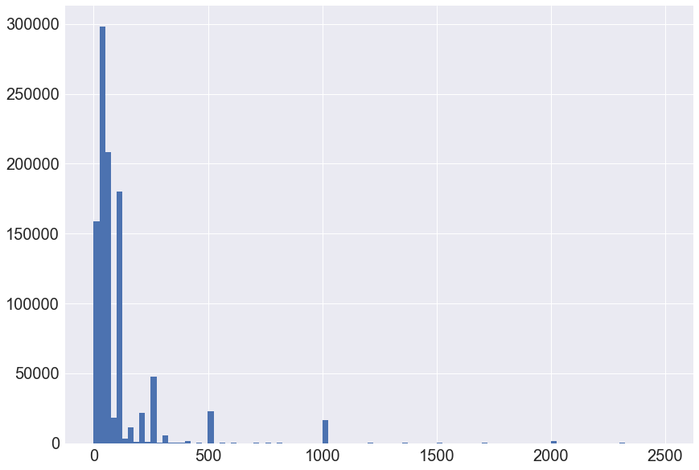


####  Seperate donations by Party, in order to do this, create a new 'Party' column. Do this by starting with the candidates and their affliliation. 


```python
# Grab candidate names from data
candidates=donor.cand_nm.unique()
candidates
```


    array(['Rubio, Marco', 'Santorum, Richard J.', 'Perry, James R. (Rick)',
           'Carson, Benjamin S.', "Cruz, Rafael Edward 'Ted'", nan,
           'Paul, Rand', 'Clinton, Hillary Rodham'], dtype=object)


```python
# Dictionary of party affiliation
party_map = {'Rubio, Marco': 'Republican',
           'Santorum, Richard J.': 'Republican',
           'Perry, James R. (Rick)': 'Republican',
           'Carson, Benjamin S.': 'Republican',
           "Cruz, Rafael Edward 'Ted'": 'Republican',
           'Paul, Rand': 'Republican',
           'Clinton, Hillary Rodham': 'Democrat',}
           

# Now map the party with candidate
donor['Party'] = donor.cand_nm.map(party_map)
```


```python
donor.head()
```


<div>
<style>
    .dataframe thead tr:only-child th {
        text-align: right;
    }

    .dataframe thead th {
        text-align: left;
    }

    .dataframe tbody tr th {
        vertical-align: top;
    }
</style>
<table border="1" class="dataframe">
  <thead>
    <tr style="text-align: right;">
      <th></th>
      <th>cmte_id</th>
      <th>cand_id</th>
      <th>cand_nm</th>
      <th>contbr_nm</th>
      <th>contbr_city</th>
      <th>contbr_st</th>
      <th>contbr_zip</th>
      <th>contbr_employer</th>
      <th>contbr_occupation</th>
      <th>contb_receipt_amt</th>
      <th>contb_receipt_dt</th>
      <th>receipt_desc</th>
      <th>memo_cd</th>
      <th>memo_text</th>
      <th>form_tp</th>
      <th>file_num</th>
      <th>tran_id</th>
      <th>election_tp</th>
      <th>Party</th>
    </tr>
  </thead>
  <tbody>
    <tr>
      <th>0</th>
      <td>C00458844</td>
      <td>P60006723</td>
      <td>Rubio, Marco</td>
      <td>BLUM, MAUREEN</td>
      <td>WASHINGTON</td>
      <td>20</td>
      <td>DC</td>
      <td>STRATEGIC COALITIONS &amp; INITIATIVES LL</td>
      <td>OUTREACH DIRECTOR</td>
      <td>175.0</td>
      <td>15-Mar-16</td>
      <td>NaN</td>
      <td>NaN</td>
      <td>NaN</td>
      <td>SA17A</td>
      <td>1082559.0</td>
      <td>SA17.1152124</td>
      <td>P2016</td>
      <td>Republican</td>
    </tr>
    <tr>
      <th>1</th>
      <td>C00458844</td>
      <td>P60006723</td>
      <td>Rubio, Marco</td>
      <td>DODSON, MARK B. MR.</td>
      <td>ATLANTA</td>
      <td>30</td>
      <td>GA</td>
      <td>MORTGAGE CAPITAL ADVISORS</td>
      <td>PRIVATE MORTGAGE BANKING</td>
      <td>25.0</td>
      <td>16-Mar-16</td>
      <td>NaN</td>
      <td>NaN</td>
      <td>DEBT RETIREMENT</td>
      <td>SA17A</td>
      <td>1082559.0</td>
      <td>SA17.1153048</td>
      <td>P2016</td>
      <td>Republican</td>
    </tr>
    <tr>
      <th>2</th>
      <td>C00458844</td>
      <td>P60006723</td>
      <td>Rubio, Marco</td>
      <td>CHILDERS, WILLIAM</td>
      <td>DPO</td>
      <td>AE</td>
      <td>98309998</td>
      <td>DIPLOMAT</td>
      <td>US GOVERNMENT</td>
      <td>100.0</td>
      <td>20-Feb-16</td>
      <td>NaN</td>
      <td>NaN</td>
      <td>NaN</td>
      <td>SA17A</td>
      <td>1056862.0</td>
      <td>SA17.1020839</td>
      <td>P2016</td>
      <td>Republican</td>
    </tr>
    <tr>
      <th>3</th>
      <td>C00458844</td>
      <td>P60006723</td>
      <td>Rubio, Marco</td>
      <td>RUCINSKI, ROBERT</td>
      <td>APO</td>
      <td>AE</td>
      <td>90960009</td>
      <td>US ARMY</td>
      <td>PHYSICIAN</td>
      <td>200.0</td>
      <td>10-Mar-16</td>
      <td>NaN</td>
      <td>NaN</td>
      <td>NaN</td>
      <td>SA17A</td>
      <td>1082559.0</td>
      <td>SA17.1078677</td>
      <td>P2016</td>
      <td>Republican</td>
    </tr>
    <tr>
      <th>4</th>
      <td>C00458844</td>
      <td>P60006723</td>
      <td>Rubio, Marco</td>
      <td>RUCINSKI, ROBERT</td>
      <td>APO</td>
      <td>AE</td>
      <td>90960009</td>
      <td>US ARMY</td>
      <td>PHYSICIAN</td>
      <td>100.0</td>
      <td>08-Mar-16</td>
      <td>NaN</td>
      <td>NaN</td>
      <td>NaN</td>
      <td>SA17A</td>
      <td>1082559.0</td>
      <td>SA17.1074981</td>
      <td>P2016</td>
      <td>Republican</td>
    </tr>
  </tbody>
</table>
</div>


```python
#  Quick look a the total amounts received by each candidate
donor.groupby('cand_nm')['contb_receipt_amt'].count()
```


    cand_nm
    Carson, Benjamin S.          244905
    Clinton, Hillary Rodham      103402
    Cruz, Rafael Edward 'Ted'    541101
    Paul, Rand                    32196
    Perry, James R. (Rick)          875
    Rubio, Marco                  99259
    Santorum, Richard J.              2
    Name: contb_receipt_amt, dtype: int64


```python
# Total donation received by each candidate
donor.groupby('cand_nm')['contb_receipt_amt'].sum()
```


    cand_nm
    Carson, Benjamin S.          2.901400e+07
    Clinton, Hillary Rodham      9.493156e+06
    Cruz, Rafael Edward 'Ted'    6.975275e+07
    Paul, Rand                   6.314863e+06
    Perry, James R. (Rick)       1.189868e+06
    Rubio, Marco                 4.054208e+07
    Santorum, Richard J.         3.500000e+02
    Name: contb_receipt_amt, dtype: float64


```python
# To make it more readable
cand_amount=donor.groupby('cand_nm')['contb_receipt_amt'].sum()
i=0
for don in cand_amount:
    print("The candidate %s raised %.0f dollars" %(cand_amount.index[i],don))
    print("\n")
    i +=1
```

    The candidate Carson, Benjamin S. raised 29014000 dollars
    
    
    The candidate Clinton, Hillary Rodham raised 9493156 dollars
    
    
    The candidate Cruz, Rafael Edward 'Ted' raised 69752747 dollars
    
    
    The candidate Paul, Rand raised 6314863 dollars
    
    
    The candidate Perry, James R. (Rick) raised 1189868 dollars
    
    
    The candidate Rubio, Marco raised 40542078 dollars
    
    
    The candidate Santorum, Richard J. raised 350 dollars
    
    
    


```python
# Plot graph
cand_amount.plot(kind='bar',legend=True,logy=True, color='blue')
```


    <matplotlib.axes._subplots.AxesSubplot at 0xba55d4a9b0>


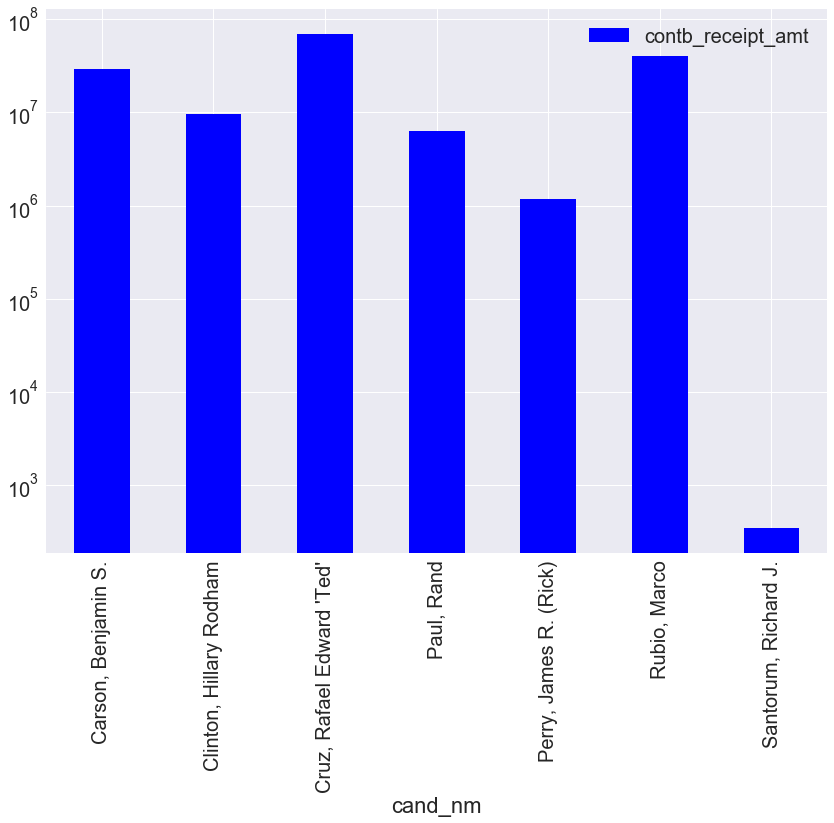


```python
# Compare Democrat versus Republican donations
donor.groupby('Party')['contb_receipt_amt'].sum().plot(kind='bar',legend=True,logy=True,color='seagreen')
```


    <matplotlib.axes._subplots.AxesSubplot at 0xba001a0240>


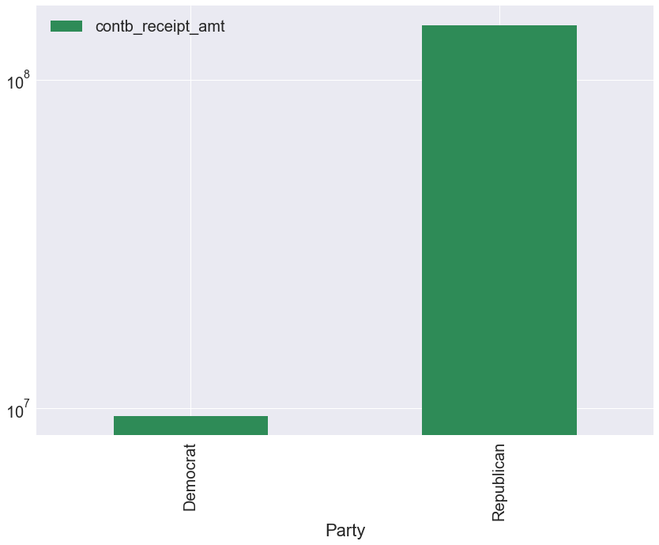


```python
# Occupations of dononrs
occupation=donor.pivot_table('contb_receipt_amt',index='contbr_occupation',columns='Party', aggfunc='sum')
occupation
```


<div>
<style>
    .dataframe thead tr:only-child th {
        text-align: right;
    }

    .dataframe thead th {
        text-align: left;
    }

    .dataframe tbody tr th {
        vertical-align: top;
    }
</style>
<table border="1" class="dataframe">
  <thead>
    <tr style="text-align: right;">
      <th>Party</th>
      <th>Democrat</th>
      <th>Republican</th>
    </tr>
    <tr>
      <th>contbr_occupation</th>
      <th></th>
      <th></th>
    </tr>
  </thead>
  <tbody>
    <tr>
      <th>ARTIST</th>
      <td>100.00</td>
      <td>NaN</td>
    </tr>
    <tr>
      <th>CLERGY</th>
      <td>1000.00</td>
      <td>NaN</td>
    </tr>
    <tr>
      <th>EDUCATOR</th>
      <td>110.55</td>
      <td>NaN</td>
    </tr>
    <tr>
      <th>MED TECH, RAD SUPERVISOR</th>
      <td>56.85</td>
      <td>NaN</td>
    </tr>
    <tr>
      <th>RETIRED</th>
      <td>10.00</td>
      <td>NaN</td>
    </tr>
    <tr>
      <th>&amp; PROFFESSOR</th>
      <td>NaN</td>
      <td>110.00</td>
    </tr>
    <tr>
      <th>(FORMER TEACHER)</th>
      <td>NaN</td>
      <td>546.46</td>
    </tr>
    <tr>
      <th>(RETIRED)</th>
      <td>NaN</td>
      <td>285.00</td>
    </tr>
    <tr>
      <th>(RETIRED) AUTOWORKER</th>
      <td>NaN</td>
      <td>190.32</td>
    </tr>
    <tr>
      <th>*</th>
      <td>NaN</td>
      <td>8550.00</td>
    </tr>
    <tr>
      <th>-</th>
      <td>NaN</td>
      <td>378.00</td>
    </tr>
    <tr>
      <th>--</th>
      <td>NaN</td>
      <td>609.00</td>
    </tr>
    <tr>
      <th>---</th>
      <td>NaN</td>
      <td>125.00</td>
    </tr>
    <tr>
      <th>---------</th>
      <td>NaN</td>
      <td>110.00</td>
    </tr>
    <tr>
      <th>.</th>
      <td>NaN</td>
      <td>856.20</td>
    </tr>
    <tr>
      <th>1-TECHNICAL TEAM LEAD/ 2-CHIEF OF DPW</th>
      <td>NaN</td>
      <td>25.00</td>
    </tr>
    <tr>
      <th>100 % DISABLED T&amp;P</th>
      <td>NaN</td>
      <td>125.00</td>
    </tr>
    <tr>
      <th>100% DISABLED VETERAN</th>
      <td>NaN</td>
      <td>265.32</td>
    </tr>
    <tr>
      <th>15G AIRFRAME REPAIRER</th>
      <td>NaN</td>
      <td>301.60</td>
    </tr>
    <tr>
      <th>1938 ENTERPRISES INC.</th>
      <td>NaN</td>
      <td>260.00</td>
    </tr>
    <tr>
      <th>1959</th>
      <td>NaN</td>
      <td>235.00</td>
    </tr>
    <tr>
      <th>1961</th>
      <td>NaN</td>
      <td>260.00</td>
    </tr>
    <tr>
      <th>1:SALES. 2:DIRECT SALES.</th>
      <td>NaN</td>
      <td>250.00</td>
    </tr>
    <tr>
      <th>1LT</th>
      <td>NaN</td>
      <td>250.00</td>
    </tr>
    <tr>
      <th>1ST ASSISTANT MANAGER</th>
      <td>NaN</td>
      <td>270.00</td>
    </tr>
    <tr>
      <th>1ST GRADE TEACHER ASSISTANT</th>
      <td>NaN</td>
      <td>250.00</td>
    </tr>
    <tr>
      <th>20 YR USAF. 20 YR EDUCATOR.</th>
      <td>50.00</td>
      <td>NaN</td>
    </tr>
    <tr>
      <th>2016158528</th>
      <td>NaN</td>
      <td>141.00</td>
    </tr>
    <tr>
      <th>2025771134</th>
      <td>NaN</td>
      <td>700.00</td>
    </tr>
    <tr>
      <th>2055855868</th>
      <td>NaN</td>
      <td>35.00</td>
    </tr>
    <tr>
      <th>...</th>
      <td>...</td>
      <td>...</td>
    </tr>
    <tr>
      <th>YOGA STUDIO OWNER, MANAGER</th>
      <td>510.00</td>
      <td>NaN</td>
    </tr>
    <tr>
      <th>YOGA TEACHER</th>
      <td>5057.45</td>
      <td>1025.00</td>
    </tr>
    <tr>
      <th>YOGA TEACHER/TRANSCRIPTIONIST</th>
      <td>NaN</td>
      <td>250.00</td>
    </tr>
    <tr>
      <th>YOGA THERAPIST</th>
      <td>250.00</td>
      <td>NaN</td>
    </tr>
    <tr>
      <th>YOGA/MASSAGE THERAPIST</th>
      <td>204.27</td>
      <td>NaN</td>
    </tr>
    <tr>
      <th>YOGA/SENIOR AIDE</th>
      <td>NaN</td>
      <td>25.00</td>
    </tr>
    <tr>
      <th>YOUNG &amp; RETIRED</th>
      <td>NaN</td>
      <td>102.00</td>
    </tr>
    <tr>
      <th>YOUNG LIVING ESSENTIAL OILS DISTRIBUTO</th>
      <td>NaN</td>
      <td>150.00</td>
    </tr>
    <tr>
      <th>YOUNG MINISTER</th>
      <td>NaN</td>
      <td>8100.00</td>
    </tr>
    <tr>
      <th>YOUNG RETIREE</th>
      <td>NaN</td>
      <td>225.00</td>
    </tr>
    <tr>
      <th>YOUNIQUE</th>
      <td>NaN</td>
      <td>50.00</td>
    </tr>
    <tr>
      <th>YOUR BUSINESS</th>
      <td>NaN</td>
      <td>1000.00</td>
    </tr>
    <tr>
      <th>YOUTH CARE WORKER</th>
      <td>525.27</td>
      <td>NaN</td>
    </tr>
    <tr>
      <th>YOUTH DEVELOPMENT</th>
      <td>NaN</td>
      <td>510.00</td>
    </tr>
    <tr>
      <th>YOUTH DEVELOPMENT SPECIALIST</th>
      <td>NaN</td>
      <td>25.00</td>
    </tr>
    <tr>
      <th>YOUTH DIRECTOR</th>
      <td>NaN</td>
      <td>1263.00</td>
    </tr>
    <tr>
      <th>YOUTH GROUP LEADER</th>
      <td>NaN</td>
      <td>200.00</td>
    </tr>
    <tr>
      <th>YOUTH MINISTER</th>
      <td>NaN</td>
      <td>500.00</td>
    </tr>
    <tr>
      <th>YOUTH MINISTRY</th>
      <td>NaN</td>
      <td>1187.50</td>
    </tr>
    <tr>
      <th>YOUTH NON-PROFIT</th>
      <td>NaN</td>
      <td>250.00</td>
    </tr>
    <tr>
      <th>YOUTH PASTOR</th>
      <td>NaN</td>
      <td>2836.00</td>
    </tr>
    <tr>
      <th>YOUTH SERVICES SPECIALIST</th>
      <td>801.90</td>
      <td>NaN</td>
    </tr>
    <tr>
      <th>YOUTH WORKER</th>
      <td>NaN</td>
      <td>65.00</td>
    </tr>
    <tr>
      <th>YOUTH WORSHIP INTERN</th>
      <td>NaN</td>
      <td>295.00</td>
    </tr>
    <tr>
      <th>YYYY</th>
      <td>NaN</td>
      <td>500.00</td>
    </tr>
    <tr>
      <th>Z</th>
      <td>NaN</td>
      <td>401.60</td>
    </tr>
    <tr>
      <th>ZACARIAS ACTUARIAL CONSULTANTS</th>
      <td>NaN</td>
      <td>125.00</td>
    </tr>
    <tr>
      <th>ZGOLF FOOD &amp; BEVERAGE SERVICES</th>
      <td>NaN</td>
      <td>500.00</td>
    </tr>
    <tr>
      <th>ZONE MANAGER</th>
      <td>155.87</td>
      <td>NaN</td>
    </tr>
    <tr>
      <th>`</th>
      <td>NaN</td>
      <td>500.00</td>
    </tr>
  </tbody>
</table>
<p>27981 rows × 2 columns</p>
</div>


```python
occupation = occupation[occupation.sum(1) > 1000000]
```


```python
occupation

```


<div>
<style>
    .dataframe thead tr:only-child th {
        text-align: right;
    }

    .dataframe thead th {
        text-align: left;
    }

    .dataframe tbody tr th {
        vertical-align: top;
    }
</style>
<table border="1" class="dataframe">
  <thead>
    <tr style="text-align: right;">
      <th>Party</th>
      <th>Democrat</th>
      <th>Republican</th>
    </tr>
    <tr>
      <th>contbr_occupation</th>
      <th></th>
      <th></th>
    </tr>
  </thead>
  <tbody>
    <tr>
      <th>ATTORNEY</th>
      <td>775497.26</td>
      <td>4.086073e+06</td>
    </tr>
    <tr>
      <th>BUSINESS OWNER</th>
      <td>27447.23</td>
      <td>1.359330e+06</td>
    </tr>
    <tr>
      <th>CEO</th>
      <td>84206.15</td>
      <td>2.939914e+06</td>
    </tr>
    <tr>
      <th>CONSULTANT</th>
      <td>181830.93</td>
      <td>1.537787e+06</td>
    </tr>
    <tr>
      <th>ENGINEER</th>
      <td>73451.60</td>
      <td>1.845427e+06</td>
    </tr>
    <tr>
      <th>EXECUTIVE</th>
      <td>51589.75</td>
      <td>1.909219e+06</td>
    </tr>
    <tr>
      <th>HOMEMAKER</th>
      <td>204830.51</td>
      <td>7.779608e+06</td>
    </tr>
    <tr>
      <th>INFORMATION REQUESTED</th>
      <td>547647.10</td>
      <td>7.788248e+05</td>
    </tr>
    <tr>
      <th>INFORMATION REQUESTED PER BEST EFFORTS</th>
      <td>NaN</td>
      <td>1.260944e+07</td>
    </tr>
    <tr>
      <th>INVESTOR</th>
      <td>35504.92</td>
      <td>1.580814e+06</td>
    </tr>
    <tr>
      <th>LAWYER</th>
      <td>217753.99</td>
      <td>1.079599e+06</td>
    </tr>
    <tr>
      <th>MANAGER</th>
      <td>61482.87</td>
      <td>1.147178e+06</td>
    </tr>
    <tr>
      <th>OWNER</th>
      <td>97052.33</td>
      <td>2.222810e+06</td>
    </tr>
    <tr>
      <th>PHYSICIAN</th>
      <td>380297.76</td>
      <td>3.267305e+06</td>
    </tr>
    <tr>
      <th>PRESIDENT</th>
      <td>118360.70</td>
      <td>2.641440e+06</td>
    </tr>
    <tr>
      <th>REAL ESTATE</th>
      <td>40303.68</td>
      <td>1.451274e+06</td>
    </tr>
    <tr>
      <th>RETIRED</th>
      <td>2327638.33</td>
      <td>3.694276e+07</td>
    </tr>
    <tr>
      <th>SALES</th>
      <td>53111.42</td>
      <td>1.286662e+06</td>
    </tr>
  </tbody>
</table>
</div>


```python
# Plot occupation
occupation.plot(kind='barh',figsize=(10,12),fontsize=12)
```


    <matplotlib.axes._subplots.AxesSubplot at 0xba00b0b978>


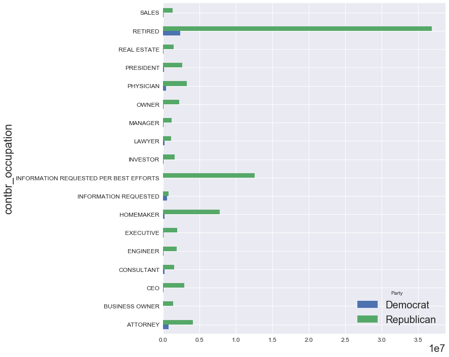


```python
# Drop rows where there is no information
occupation.drop(['INFORMATION REQUESTED PER BEST EFFORTS','INFORMATION REQUESTED'],axis=0,inplace=True)
```

    C:\Users\mihir_garg\Anaconda3\lib\site-packages\ipykernel_launcher.py:2: SettingWithCopyWarning: 
    A value is trying to be set on a copy of a slice from a DataFrame
    
    See the caveats in the documentation: http://pandas.pydata.org/pandas-docs/stable/indexing.html#indexing-view-versus-copy
      
    


```python
occupation.plot(kind='barh',figsize=(10,12),cmap='seismic')
```


    <matplotlib.axes._subplots.AxesSubplot at 0xba00afd550>


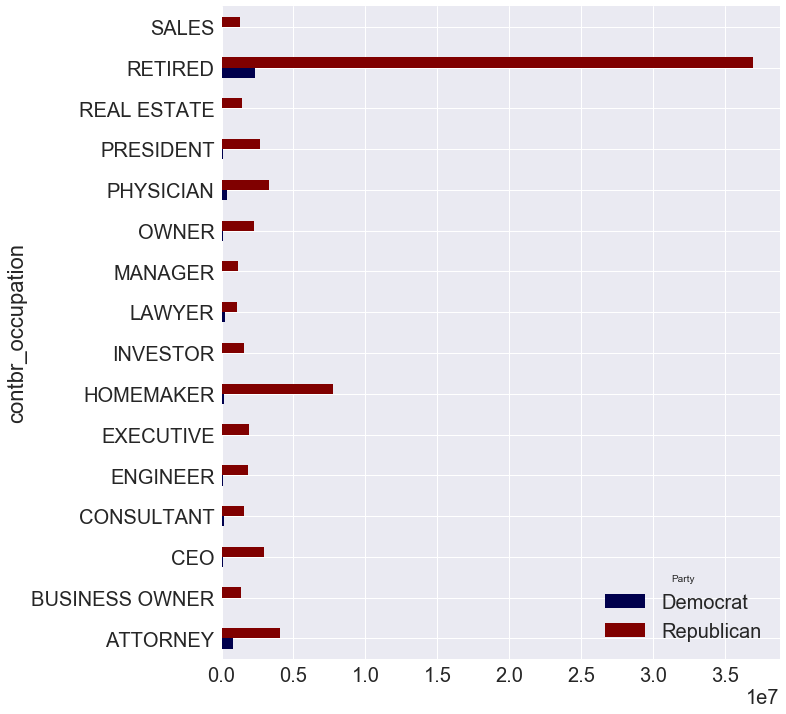


```python

```
